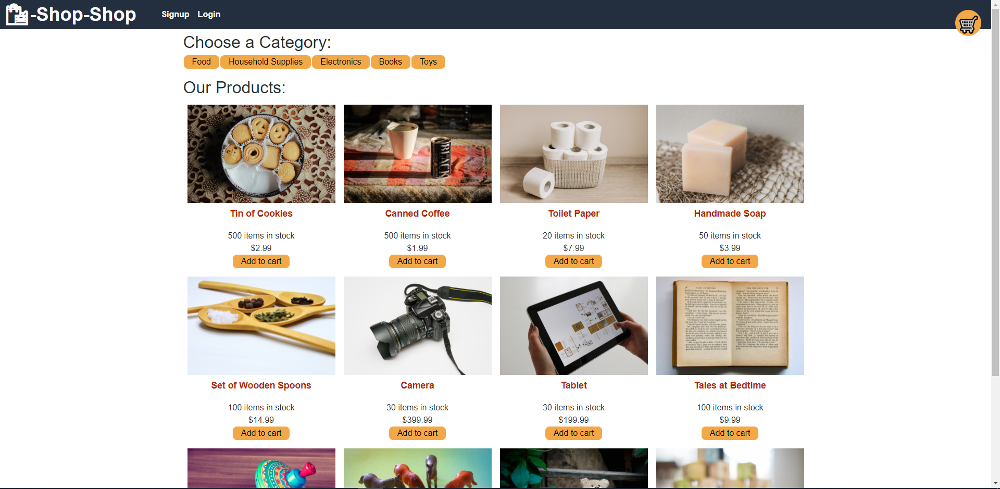

# Shop-Shop Redux Refractor

## Description 

This application is a refractor of an e-commerce website.  Instead of using the React Context API, the application is now using Redux to handle a global store of state.  Each component now uses Redux and handles state using redux.  Having a global store in a large application will prevent prop drilling, bugs, and other headaches.  The developer will know exactly where the state is coming from.  To use my application, visit the deployment [here](https://shop-shop-week22.herokuapp.com/).

 

## Table of Contents 

* [Installation](#installation)
* [Usage](#usage)
* [License](#license)

## Installation 

No need to install!  Please visit the deployment link to use: https://shop-shop-week22.herokuapp.com/ 

## Usage 

To use this application, first visit the deployed app: https://shop-shop-week22.herokuapp.com/  

* You can create an account with the signup button on the top of the page.  Your cart data will be linked to your account.
* You can browse the products by category, see their details, and add them to cart.
* Your cart in the top right holds all the products you have saved to your cart.  You can update all the items in your cart.
* Once your ready to checkout, hit the checkout button that will take you to a payment page using Stripe

## License 

MIT License

Copyright (c) 2021 Nick Giuliani

Permission is hereby granted, free of charge, to any person obtaining a copy
of this software and associated documentation files (the "Software"), to deal
in the Software without restriction, including without limitation the rights
to use, copy, modify, merge, publish, distribute, sublicense, and/or sell
copies of the Software, and to permit persons to whom the Software is
furnished to do so, subject to the following conditions:

The above copyright notice and this permission notice shall be included in all
copies or substantial portions of the Software.

THE SOFTWARE IS PROVIDED "AS IS", WITHOUT WARRANTY OF ANY KIND, EXPRESS OR
IMPLIED, INCLUDING BUT NOT LIMITED TO THE WARRANTIES OF MERCHANTABILITY,
FITNESS FOR A PARTICULAR PURPOSE AND NONINFRINGEMENT. IN NO EVENT SHALL THE
AUTHORS OR COPYRIGHT HOLDERS BE LIABLE FOR ANY CLAIM, DAMAGES OR OTHER
LIABILITY, WHETHER IN AN ACTION OF CONTRACT, TORT OR OTHERWISE, ARISING FROM,
OUT OF OR IN CONNECTION WITH THE SOFTWARE OR THE USE OR OTHER DEALINGS IN THE
SOFTWARE.
